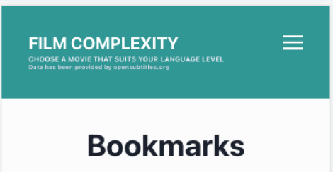
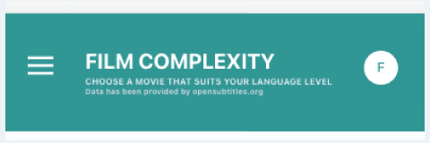

# Задание 

## Что нужно сделать 
1) Нужно изменить заголовок мобильной версии сайта

Сейчас заголовок сайта в мобильной версии выглядит вот так:  

Нужно сделать вот так:  

Для неавторизованных пользователей использовать другую иконку:  

Вид для авторизованных пользователей будет доступен по ссылке  
http://localhost:3000/authorized

Для неавторизованных по ссылке  
http://localhost:3000/

2) Сделать PR в этот репозиторий

## Критерии завершенности
- Открывается меню по нажатию на бургер-иконку слева
- Кнопка справа ведет на страницу профиля/авторизации
